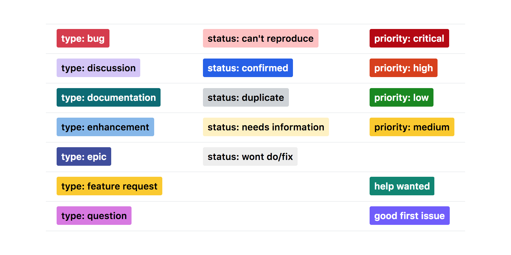

# GitHub labels

[](https://opensource.org/licenses/MIT)

:label: A list of GitHub labels for reuse across projects.

<div align="center">
	<p>
    
	</p>
	<p>
		<sub>:gift: Follow me on <a href="https://twitter.com/abdonrd"><code>Twitter</code></a> if you like this project</sub>
	</p>
</div>

## Demo
You can find a demo [here in this same repository](https://github.com/abdonrd/github-labels/labels).

## Use
You can use the [`github-labels` package](https://www.npmjs.com/package/github-labels)
to import the labels to your project. In example:

```sh
git clone https://github.com/abdonrd/github-labels
cd github-labels

npx github-labels -c ./github-labels.json abdonrd/freestylestats.com

# Two-factor
# npx github-labels -c ./github-labels.json --token YOUR_PERSONAL_TOKEN abdonrd/freestylestats.com
```

If the project requires it, it is advisable to add some source tags:
`source: sourceName`.
